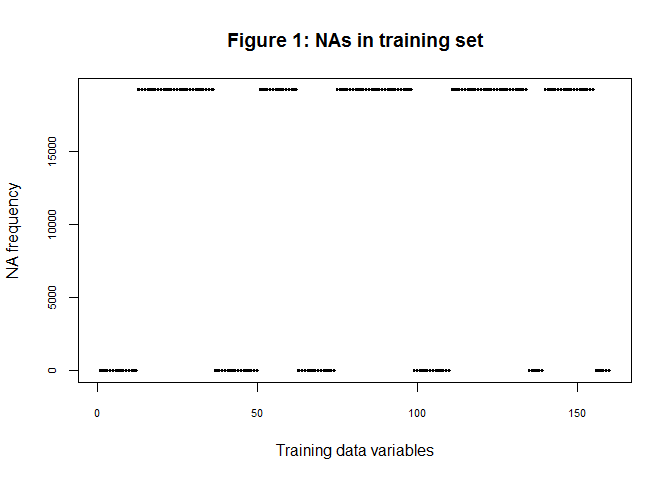
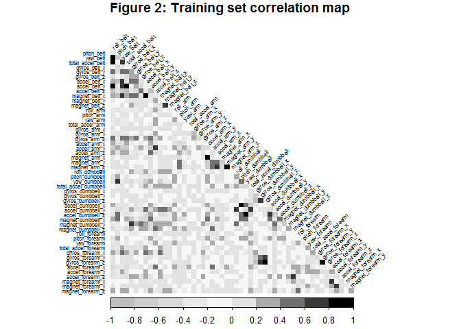

# Weight Lifting Exercise Prediction
Evelyn Baskaradas  
March 30, 2017  
<STYLE TYPE="text/css">
<!--
caption {
font-weight: bold;
font-size: 1em;
} 

.table {
width: 50%;
margin-left: 5%;
font-size: 0.8em;
}

h1 {
font-size: 180%
}

h2 {
font-size: 150%
}

h3 {
font-size: 120%
}

p {
font-size: 90%;
}

li {
font-size: 90%;
}
--->
</STYLE>


# Overview
Using devices such as *Jawbone Up*, *Nike FuelBand*, and *Fitbit* it is now possible to collect a large amount of data about personal activity relatively inexpensively. These type of devices are part of the quantified self movement, a group of enthusiasts who take measurements about themselves regularly to improve their health, to find patterns in their behavior, or because they are tech geeks. One thing that people regularly do is quantify how much of a particular activity they do, but they rarely quantify how well they do it. 

In this project, the goal is to use data from accelerometers on the belt, forearm, arm, and dumbell of 6 participants to predict the manner in which they did the exercise. They were asked to perform barbell lifts correctly and incorrectly in 5 different ways, recorded in <code>classe</code> in the data set. 

More information is available from the [Groupware@LES website](http://groupware.les.inf.puc-rio.br/har) (see the section on the Weight Lifting Exercise Dataset).

# Download the data
The training data for this project is available [here](https://d396qusza40orc.cloudfront.net/predmachlearn/pml-training.csv) and test data [here](https://d396qusza40orc.cloudfront.net/predmachlearn/pml-testing.csv).

The data for this project comes from [this source](http://groupware.les.inf.puc-rio.br/har).


The files were last downloaded on Thursday, March 30, 2017.

# Load, clean, and summarize the data
First we load the data into R, substituting blanks with "NA" values. 
Then we check the dimensions of both the training and test sets.


```r
training <- read.csv(trainFileName, na.strings = c("", "NA"))
testing <- read.csv(testFileName, na.strings = c("", "NA"))
```


Table: Table 1: Training and Testing set dimensions

File        Observations   Variables
---------  -------------  ----------
Training           19622         160
Testing               20         160

The final column <code>classe</code> contains the outcomes we will attempt to predict with the chosen model.


```
##  Factor w/ 5 levels "A","B","C","D",..: 1 1 1 1 1 1 1 1 1 1 ...
```


As there are 160 variables, we should determine the distribution of NA values to exclude them, thus reducing the number of variables to a more manageable set.

<!-- -->

We find that there are 100 columns with NA values that can be excluded.

We can also exclude the first 7 columns with names, timestamps, and other data that are not pertinent to predicting <code>classe</code>.


```
## [1] "X"                    "user_name"            "raw_timestamp_part_1"
## [4] "raw_timestamp_part_2" "cvtd_timestamp"       "new_window"          
## [7] "num_window"
```


Table: Table 2: Training and Testing set dimensions excluding NAs

File        Observations   Variables
---------  -------------  ----------
Training           19622          53
Testing               20          53

# Create validation set
We then create a validation set from the training set to estimate how well the chosen model has been trained.


```r
set.seed(123)
inTrain <- createDataPartition(y = training$classe, p = 0.7, list = FALSE)
training <- training[inTrain,]
validation <- training[-inTrain,]
```


Table: Table 3: Training and Validation set dimensions

File          Observations   Variables
-----------  -------------  ----------
Training             13737          53
Validation            4117          53

# Model Building

## Variable selection
In building models, we should see if there are highly correlated variables that can be excluded to reduce variance.

Let's take a look at the correlations.

<!-- -->


By removing variables that a highly correlated (> |0.75|), we are able to reduce the predictors further to the following 31 variables.


```
##  [1] "yaw_belt"             "gyros_belt_x"         "gyros_belt_y"        
##  [4] "gyros_belt_z"         "magnet_belt_x"        "magnet_belt_y"       
##  [7] "roll_arm"             "pitch_arm"            "yaw_arm"             
## [10] "total_accel_arm"      "gyros_arm_y"          "gyros_arm_z"         
## [13] "magnet_arm_x"         "magnet_arm_z"         "roll_dumbbell"       
## [16] "pitch_dumbbell"       "yaw_dumbbell"         "total_accel_dumbbell"
## [19] "gyros_dumbbell_y"     "magnet_dumbbell_z"    "roll_forearm"        
## [22] "pitch_forearm"        "yaw_forearm"          "total_accel_forearm" 
## [25] "gyros_forearm_x"      "gyros_forearm_z"      "accel_forearm_x"     
## [28] "accel_forearm_z"      "magnet_forearm_x"     "magnet_forearm_y"    
## [31] "magnet_forearm_z"
```

## Cross validation

We shall use k-fold Cross Validation to estimate the accuracy of the model.
In this case, the dataset will be split into 3 subsets (k = 3).


```r
control <- trainControl(method = "cv", number = 3)
metric <- "Accuracy"
```

## Test Models
We shall test the accuracies of a number of models; Linear Discriminant Analysis (LDA), Random Forests (RF), and Gradient Boosting Machine (GBM).

### Linear Discriminant Analysis (LDA)

```r
set.seed(123)
modLDA <- train(classe ~ ., 
data = newtraining, 
method = "lda", 
metric = metric, 
trControl = control)
```

### Random Forests (RF)


```r
set.seed(123)
modRF <- train(classe ~ ., 
data = newtraining, 
method = "rf", 
metric = metric, 
trControl = control,
ntree = 100,
prox = TRUE)
```

### Gradient Boosting Machine (GBM)


```r
set.seed(123)
modGBM <- train(classe ~ ., 
data = newtraining, 
method = "gbm", 
metric = metric, 
trControl = control,
verbose = FALSE)
```

## Accuracy results

The accuracies of each model are as follows:


Table: Table 4: Model accuracies

LDA       RF        GBM     
--------  --------  --------
58.54 %   98.68 %   93.86 % 

# Model selection
We select Random Forest as it has the highest accuracy among all the models at 98.68%.

Note that training the RF model with the default <code>ntree</code> = 500 showed the error rates minimized at around 100 trees. By setting <code>ntree</code> = 100, the time taken to train the model reduced by 30%.


```
## Random Forest 
## 
## 13737 samples
##    31 predictor
##     5 classes: 'A', 'B', 'C', 'D', 'E' 
## 
## No pre-processing
## Resampling: Cross-Validated (3 fold) 
## Summary of sample sizes: 9157, 9160, 9157 
## Resampling results across tuning parameters:
## 
##   mtry  Accuracy   Kappa    
##    2    0.9868234  0.9833301
##   16    0.9860228  0.9823180
##   31    0.9780879  0.9722815
## 
## Accuracy was used to select the optimal model using  the largest value.
## The final value used for the model was mtry = 2.
```

# Predict on Validation set

We apply the model to the validation set to estimate the prediction accuracy using the RF model.


```r
predictions <- predict(modRF, validation)
confMat <- confusionMatrix(predictions, validation$classe)

print(confMat)
```

```
## Confusion Matrix and Statistics
## 
##           Reference
## Prediction    A    B    C    D    E
##          A 1161    0    0    0    0
##          B    0  791    0    0    0
##          C    0    0  739    0    0
##          D    0    0    0  655    0
##          E    0    0    0    0  771
## 
## Overall Statistics
##                                      
##                Accuracy : 1          
##                  95% CI : (0.9991, 1)
##     No Information Rate : 0.282      
##     P-Value [Acc > NIR] : < 2.2e-16  
##                                      
##                   Kappa : 1          
##  Mcnemar's Test P-Value : NA         
## 
## Statistics by Class:
## 
##                      Class: A Class: B Class: C Class: D Class: E
## Sensitivity             1.000   1.0000   1.0000   1.0000   1.0000
## Specificity             1.000   1.0000   1.0000   1.0000   1.0000
## Pos Pred Value          1.000   1.0000   1.0000   1.0000   1.0000
## Neg Pred Value          1.000   1.0000   1.0000   1.0000   1.0000
## Prevalence              0.282   0.1921   0.1795   0.1591   0.1873
## Detection Rate          0.282   0.1921   0.1795   0.1591   0.1873
## Detection Prevalence    0.282   0.1921   0.1795   0.1591   0.1873
## Balanced Accuracy       1.000   1.0000   1.0000   1.0000   1.0000
```

The prediction accuracy is 100%, and therefore the out of sample error is 0%.

# Predict on Test set

Similar 100% accuracy is also achieved when the model is applied to the test set.


Table: Table 5: Testing set predictions

problem_id   1    2    3    4    5    6    7    8    9    10   11   12   13   14   15   16   17   18   19   20 
-----------  ---  ---  ---  ---  ---  ---  ---  ---  ---  ---  ---  ---  ---  ---  ---  ---  ---  ---  ---  ---
Prediction   B    A    B    A    A    E    D    B    A    A    B    C    B    A    E    E    A    B    B    B  

# Conclusion

The Random Forest model proved to be robust in terms of accuracy on both the validation and testing data sets. The main drawback in the long processing time taken for training the model was mitigated by first reducing the number of predictors (159 to 31) and then the ntree number (500 to 100) where the minimum error rates begin to plateau.
